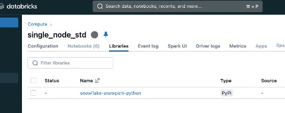

# snowpark_in_databricks_notebook
Sample Notebook and cluster config to use Snowpark from databricks

## Go to Compute cluster libraries and add a new PyPi package 
`snowflake-snowpark-python`

## Package will be added when start your cluster
